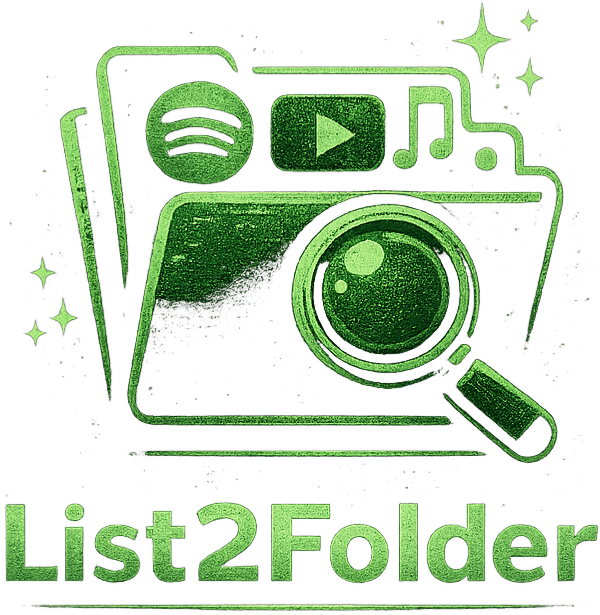

<div align="center">
  
  <br>
  <strong style="font-size:32px">List2Folder</strong>
</div>

<p align="center">
  Turn Spotify / YouTube Music playlists into a local folder by matching tracks in your library.
</p>

<p align="center">
  <a href="https://github.com/Rincodev/List2Folder/releases/latest">
    
  </a>
  <a href="LICENSE">
    
  </a>
  
  
  
  <a href="https://github.com/Rincodev/List2Folder/releases">
    
  </a>
</p>

<p align="center">
  <a href="docs/en/index.md"></a>
  <a href="docs/ru/index.md"></a>
  <!-- <a href="docs/cs/index.md"></a> -->
  <!-- <a href="docs/ua/index.md"></a> -->
</p>

<p align="center">
  <a href="docs/en/index.md">
    
  </a>
  <a href="docs/en/index.md#usage">
    
  </a>
  <a href="https://github.com/Rincodev/List2Folder/releases/latest">
    
  </a>
</p>

<p align="center">
  No downloading. Works with your existing files: match by tags (ID3/FLAC) + optional fuzzy matching, then copy/move into a new folder.
</p>

---

<p align="center">
  <a href="https://www.linkedin.com/in/bohdan-yatsenko-880a4831b/" target="_blank">
    
  </a>
  <a href="https://bohdan.admstore.cz/en/" target="_blank">
    
  </a>
</p>

---

## Features
- Read playlists from **Spotify** or **YouTube Music**.
- Scan your local library and match tracks using **audio tags** (title/artist/album).
- Optional **fuzzy matching** (handles small differences like “Remastered”, “feat.”, punctuation).
- **Copy** (default) or **move** matched files into an output folder.
- Safe file handling: avoids overwrites by auto-renaming duplicates.
- Generates a simple report: matched / missing.

---

## Quick start

### 1) Install

```bash
pip install -r requirements.txt
```

### 2) Run

```bash
python -m list2folder --help
```

---

## Providers

### Spotify
You’ll need OAuth credentials:
- `SPOTIPY_CLIENT_ID`
- `SPOTIPY_CLIENT_SECRET`
- `SPOTIPY_REDIRECT_URI` (example: `http://localhost:8888/callback`)

Put them into environment variables (recommended) or a local `.env` (do not commit).

### YouTube Music
Uses `ytmusicapi` (unofficial). You’ll export browser auth headers into a local file:
- `headers_auth.json` (must be **gitignored**)

Docs: see `docs/en/index.md`.

---

<a id="usage"></a>
## Usage

### Export a Spotify playlist to a folder

```bash
python -m list2folder \
  --source spotify \
  --playlist "https://open.spotify.com/playlist/XXXX" \
  --library "/path/to/your/music" \
  --out "/path/to/output" \
  --mode copy
```

### Export a YouTube Music playlist to a folder

```bash
python -m list2folder \
  --source ytmusic \
  --playlist "PLxxxxxxxxxxxx" \
  --headers "./headers_auth.json" \
  --library "/path/to/your/music" \
  --out "/path/to/output"
```

### Useful options

```bash
--album "Album Name"      # restrict local search to a specific album
--min-score 92            # fuzzy threshold (0..100)
--mode copy|move          # default: copy
--dry-run                 # show what would happen without writing files
--report "./report.csv"   # save matched/missing list (optional)
```

---

## How matching works
1) Prefer **tags** (artist + title).
2) If tags are missing, fall back to **filename**.
3) Normalize text (case, punctuation, “feat.”, brackets).
4) If no exact match exists, use **fuzzy matching** (threshold via `--min-score`).

---

## Limitations / notes
- This tool does **not** download music. It only organizes files you already own.
- Playlist sources may change behavior over time (especially YouTube Music integrations).
- Best results when your library has correct metadata tags.

---

## Roadmap
- [ ] Create `.m3u` playlist alongside exported folder
- [ ] Track-number ordering in output (01, 02, 03…)
- [ ] Better multi-artist handling (collabs)

---

## Contributing
PRs and issues are welcome. If you add a provider or improve matching, please include a small test sample.

---

## License
MIT — see [LICENSE](LICENSE).

---

## Repo structure to add (for full functionality)

### Minimum (working CLI)

```
list2folder/
  __init__.py
  __main__.py      # allow: python -m list2folder
  cli.py           # argparse/typer entry
  matching.py      # normalization + fuzzy matching
  library.py       # scan local files + read tags (mutagen)
  operations.py    # copy/move + safe rename
  providers/
    __init__.py
    spotify.py     # spotipy provider
    ytmusic.py     # ytmusicapi provider
```

### Dependencies

- `requirements.txt` OR `pyproject.toml` (recommended for releases)
- Typical deps: `mutagen`, `rapidfuzz`, `spotipy`, `ytmusicapi`, `python-dotenv` (optional)

### Docs (FireLog Insight style)

```
docs/
  assets/
    logo.png
  en/index.md
  ru/index.md
```

### Optional but recommended

```
.github/workflows/
  ci.yml           # lint + tests

tests/
  test_matching.py
  test_library_scan.py

.env.example       # spotify env template
.gitignore         # include .env, headers_auth.json, venv, dist, etc.
CHANGELOG.md       # releases
CONTRIBUTING.md    # contribution guide
```

---

## Notes for .gitignore (must include)
- `.env`
- `headers_auth.json`
- `.venv/`, `venv/`
- `__pycache__/`
- `dist/`, `build/`, `*.egg-info/`
- `.pytest_cache/`
